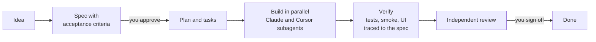

# Vibe-check-cli

**Spec-driven, multi-agent development for Claude Code and Cursor.** Claude Code leads; Claude and Cursor subagents build in parallel; nothing ships until it's traced to a spec and passes tests, smoke tests and UI tests.


Vibe-check-cli is a Claude Code plugin plus a team kit. Install it once and every developer gets the same workflow, the same skills and subagents, and the same quality gates, in both Claude Code and Cursor.

## How it works



1. **Describe it by menu.** `/vibe-check-cli:new-project` asks about platform, constraints, architecture, stack and security, with up to four options per question. It recommends a stack layer by layer, with the licences shown, and writes the decision down.
2. **Specs before code.** Every feature gets testable acceptance criteria and a plan. Hooks block code edits until a spec is approved.
3. **Parallel builders.** Independent tasks go to Claude and Cursor agents at the same time, each in its own git worktree. Routing rules decide who builds what.
4. **Proof, not promises.** Each acceptance criterion must be traced to a named test. Tests, smoke tests and UI tests must pass on the exact commit, and docs and diagrams must be fresh.
5. **You decide.** You approve specs and plans, and sign off finished features.

## What's in the box

| | |
|---|---|
| **Workflow commands** | `/vibe-check-cli:new-project`, `run`, `spec-feature`, `plan-feature`, `implement-feature`, `dispatch`, `merge-lanes`, `review-feature`, `security`, `docs`, `rearchitect`, `spec-check`, `setup`, `health` |
| **Subagents** | **architect**, **test-engineer**, **implementer**, **reviewer**, plus the team's own (for example **database-reviewer**, **security-reviewer**), in Claude Code and Cursor |
| **Team skills** | A shared kit in [`team/`](team/), including a curated selection from [Everything Claude Code](https://github.com/affaan-m/ECC) (API design, TDD, security review, Docker, deployment and more) |
| **Guardrails** | Hooks at session start, before every edit, and at the end of every turn |
| **Artefacts that agree** | `analyze` reports criteria with no task, tasks pointing at criteria that no longer exist, and `[P]` tasks that would collide; `clarify` asks about what a spec left undecided before it is planned |
| **No vague briefs** | Say "a stock management app" — or "a recipe app", or anything else — and it asks what you track, whether each one is identified individually or counted in bulk, its lifecycle, its roles and what it must prove, before any question about frameworks |
| **Your requirements** | `feature --from <file>` seeds a spec from a requirements doc you already have, keeping and marking the lines that are not testable yet instead of dropping them |
| **Design gate** | `new-project` designs the screens with Claude Design, stops for you to approve an artboard, and refuses to start a UI feature until one is recorded |
| **Review gate** | A feature cannot be marked done without an approving `review.md` for the current commit; a review of code that has since changed does not count |
| **Quality gates** | Acceptance-criteria traceability, test, smoke and UI evidence per commit, living docs, a security baseline mapped to OWASP ASVS |
| **Flake detection** | Each suite can be required to pass *n* times (`standards.testing.runs`, or `--repeat`). A suite that passes sometimes is reported as flaky and does not count as evidence |
| **Live status page** | `vibecheck dashboard` renders the whole lifecycle *and* test status to one self-contained HTML page; setup, dispatch and init open it automatically and refresh it as they run |
| **Browser wizard** | Not everyone wants twenty questions in a terminal. `vibecheck wizard` opens a form in the browser, then hands back a `requirements.json` that `advise apply` scaffolds from — the same catalogue, the same licence rules |
| **Boilerplate, if one fits** | Once the stack is chosen, `advise` offers starters that actually fit it — ABP, ASP.NET Zero, JHipster, create-t3-app, Cookiecutter Django and others — each with its licence and whether it costs money, or generates the structure from scratch |
| **A CLI that guides** | Bare `vibecheck` reads the folder and answers *what do I do next*, rather than printing every command. A mistyped command suggests the right one and exits non-zero, so a typo cannot look like success |
| **Machine setup** | `setup` installs and configures what each machine needs; `health` checks everything and names the fix |
| **Any agent editor** | One project, four front ends: Claude Code, Cursor, Google Antigravity and Windsurf each get their own generated config from a single `specs/project.json`; Codex reads `AGENTS.md` directly |
| **Standards, injected** | `standards/` holds one file per topic with a tiny `index.yml`; `vibecheck standards inject "<task>"` returns only the standards that matter, instead of loading the library |
| **Brownfield** | `adopt` detects the stack of an existing repository and writes as-is docs, guessing nothing |
| **Anti-hallucination** | Every generated `AGENTS.md` carries mandatory evidence rules: cite the source, never invent an API or command, never report an unrun check as passing |

About 2,200 tokens of always-on context per session, as measured by Claude Code.

## Quick start

**Joining a team?** Follow **[ONBOARDING.md](ONBOARDING.md)**: from a fresh machine to a working setup in about 30 minutes, on Windows, Mac or Linux.

In short: install **Cursor**, add the **Claude Code** extension (by Anthropic) and sign in. Then, in Cursor's terminal, run the commands for your system.

**Windows** (PowerShell)
```powershell
winget install --id Git.Git -e
# open a new terminal tab, then:
git clone TEAM-REPO-URL "$HOME\tools\vibe-check-cli"
powershell -ExecutionPolicy Bypass -File "$HOME\tools\vibe-check-cli\plugin\scripts\onboard.ps1" TEAM-REPO-URL
```

**macOS and Linux**
```bash
git clone TEAM-REPO-URL ~/tools/vibe-check-cli
bash ~/tools/vibe-check-cli/plugin/scripts/onboard.sh TEAM-REPO-URL
```

Then, in the Claude Code panel:

```text
/reload-plugins
/vibe-check-cli:setup
/vibe-check-cli:health live
```

## Everyday use

| You want to… | Type in the Claude panel |
|---|---|
| Start a project | `/vibe-check-cli:new-project <what you're building>` |
| Fill the spec in a browser instead | `vibecheck wizard` in a terminal, then `vibecheck advise apply` |
| Start from an existing codebase | `vibecheck adopt` in a terminal, then `/vibe-check-cli:run` |
| Keep going | `/vibe-check-cli:run` (stops at every decision that's yours) |
| See where everything stands | `vibecheck dashboard --open` |
| Check your machine | `/vibe-check-cli:health` |
| See all your projects | "list my projects" |
| Check the specs are consistent | `/vibe-check-cli:spec-check` |

Projects live in `~/projects/<name>` (on Windows, `C:\Users\<you>\projects\<name>`).

## Requirements

- **Cursor** with the **Claude Code** extension, Claude Code on its own, or **Google Antigravity** — every project is scaffolded for all three
- A Claude plan that includes Claude Code, and a Cursor account
- **Git**, and **Node.js 20+** (the setup installs Node.js if it's missing)
- **Docker**, the **Cursor CLI** and **agentmemory** — `vibecheck setup` installs
  these on every machine. They are requirements, not per-project extras, so switching engine
  or memory provider later never leaves you missing a tool.
  On native Windows agentmemory has no automatic install and is reported as a manual WSL2
  step; `vibecheck health` will keep flagging it until you move to WSL2 or accept it.
- Windows 10 22H2 or 11, macOS 14 or newer, or a modern Linux (WSL2 works too). The test suite runs on all three in CI on every pull request

## Documentation

| Guide | For |
|---|---|
| [ONBOARDING.md](ONBOARDING.md) | New developers: setup on Windows, Mac and Linux |
| [TEAM.md](TEAM.md) | Leads: sharing skills, subagents and plugins with everyone; importing ECC pieces |
| [SETUP-WINDOWS.md](SETUP-WINDOWS.md) · [SETUP-MAC.md](SETUP-MAC.md) | A detailed personal setup, including WSL2 |
| [GUIDE.md](GUIDE.md) | Working day to day: parallel agents, testing, reviews, troubleshooting |
| [docs/BROWNFIELD.md](docs/BROWNFIELD.md) | Existing codebases: adopt, and the assess/modernize/migrate plan |
| [docs/MULTI-EDITOR.md](docs/MULTI-EDITOR.md) | Using Claude Code, Cursor, Antigravity, Windsurf or Codex on the same project |
| [docs/STANDARDS.md](docs/STANDARDS.md) | Coding standards as a library, injected only where relevant |
| [docs/REFERENCE.md](docs/REFERENCE.md) | Every feature, setting and command |

## Updating and starting over

When the team kit changes: `git pull` in `~/tools/vibe-check-cli`, rerun the bootstrap for your OS (see [ONBOARDING.md](ONBOARDING.md#keeping-up-to-date)), then `/reload-plugins`. To remove every trace and reinstall, while keeping your projects, use the reset script ([ONBOARDING.md](ONBOARDING.md#starting-over)).

**Developing the plugin itself?** Your marketplace may point at your working copy rather than a
clone you pull. Before uninstalling and reinstalling to pick up new capabilities, run
`npm run build` in `plugin/` and bump `version` in `.claude-plugin/marketplace.json` — Claude Code
caches the installed plugin per version, and skills are generated rather than hand-written. See
[ONBOARDING.md](ONBOARDING.md#if-you-develop-the-plugin-itself).

## Status

**Beta.** The plugin passes Claude Code's own validator and 299 integration tests, and each setup path has been rehearsed end to end against real Claude Code, including the Windows scripts under PowerShell. It hasn't yet been run by a wide group of developers on real Windows PCs and Macs, so please report anything that doesn't match the guides.

## Development

```bash
cd plugin
npm test          # 299 integration tests
npm run build     # regenerate plugin skills and subagents (including the team kit)
```

Maintaining the team kit: `vibecheck team capture`, `vibecheck team import-ecc`, `vibecheck team status` (see [TEAM.md](TEAM.md)).

## License

No licence has been chosen for Vibe-check-cli yet (see [docs/GITHUB.md](docs/GITHUB.md)). Third-party content in the team kit keeps its own licence: see [THIRD_PARTY_NOTICES.md](team/THIRD_PARTY_NOTICES.md).
