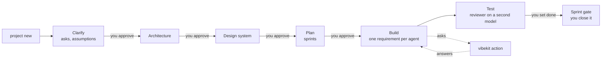

# VibeKit

**Spec-driven development for coding agents, with a person deciding every question that matters.**

Coding agents are fast, and they guess. VibeKit puts one folder in your repo, `vibekit/`, that every agent reads: what the app is, what agents may and may not do, what your words mean, what has been decided, and what is next. An agent that lacks information writes an ask and stops. It never fills a gap with a guess. Between every stage is a gate: a line a human writes. Nothing advances itself.


VibeKit is a Claude Code plugin and a CLI with no runtime dependencies. It works with Claude Code, Cursor, Codex and any MCP client, because everything it enforces is a Markdown file in git. The full design is [the specification](spec/vibekit-specification.md).

## Two commands a day

```bash
vibekit action        # everything waiting on you, across every project, most blocking first
vibekit sprint run    # work the current sprint with several agents at once
```

`vibekit action answer` walks you through the questions one at a time. Or none of this, and the tracker on your phone.

## The flow



1. **Start.** `vibekit project new` — name it, say where it lives, say what you want or hand over the requirements document. It is redacted before it touches git.
2. **Clarify.** The analyst asks about everything the source does not settle, ten questions a round, in plain terms. What it cannot ask becomes an assumption with an id and a confidence.
3. **Architecture, design, plan.** Each proposed with reasons; you approve each with a line in the file. The plan is sprints in dependency order, walking skeleton first.
4. **Build.** One requirement per agent per branch. Approach before code, failing tests per criterion, `vibekit verify` captures the exit codes, `tested` is refused without them.
5. **Test.** A reviewer on a different model maps every criterion to a named test and writes the verdict. A person sets `done`. A person closes the sprint.

## The commands

| Group | Commands |
|---|---|
| **Projects** | `project new` · `project select` · `project status [--all]` · `project import <repo>` · `project assess "<idea>"` · `project stop` · `project resume` |
| **Sprints** | `sprint plan [--cost]` · `sprint start` · `sprint run [--lanes N] [--until blocked]` · `sprint status` · `sprint close --by "<name>"` |
| **Action needed** | `action` · `action answer` (a walk-through) · `action answer <n> "<answer>" …` · `action export` / `action answer --from answers.md` · `tracker <project>` |
| **Work** | `feature add "<text>"` · `bug "<text>" --test <path>` · `bug assess|fix|test BUG-001` · `hotfix "<text>"` · `review` · `why <file:line>` |
| **Design** | `design` · `design add <url|image>` · `design preview` · `design apply` · `design feedback "<text>"` |
| **Quality** | `security scan [--url]` · `check [--ci] [--security] [--deps] [--parity] [--servers] [--budget]` · `docs` · `report build|budget|security` |
| **Shipping** | `release [<version>]` · `rollback <tag>` · `undo <id>` |
| **Setup** | `init` · `team` · `cost` · `settings [<key> <value> | tiers | frameworks | server | trust]` · `ext add|list|update|remove|verify|sign|keygen` · `tools skills import <repo>` · `tools rates` |

Every older verb (`next`, `pause`, `understand`, `arch-docs`, `quick`, `revert`, `config`) still works as an alias of the command above. `vibekit --help` lists everything; bare `vibekit` says what to do next in this folder.

## What it enforces, mechanically

- **Closed vocabulary.** An entity or field not in `entities.md` is refused; the agent proposes it with an ask.
- **Definition of ready and done.** EARS criteria that parse, a size, a source, a security note for M and L; a named passing test per criterion, review, evidence for this commit, no open asks.
- **Evidence, not claims.** `vibekit verify` writes commit, suite and exit code into the requirement. Red, dirty, another commit, or a skipped test: `tested` is refused.
- **Roles.** The implementer cannot edit `standards/`; the reviewer cannot write code; nobody but a person sets `done` or closes a sprint. `vibekit serve` enforces the loads manifest, the writes list and the allowed commands over MCP; `--sandbox` runs every command in a container.
- **Git hooks.** No commit straight onto `main`; a commit on `req/*` carries its requirement id and trailer; no staged secret, key or personal data; no force push to a protected branch.
- **Bugs.** A bug is a requirement with a severity, who found it, and a reproducing test. No test, no bug. An agent may not set severity above medium and may not close one. Fixing is three jobs — assess, fix, test — and the verdict is one word.
- **Sprint gate.** Everything done, checks green, no high security finding, documents regenerated, reports produced, lessons proposed, and a person's name.
- **Convergence.** Work is finished when a check says it stopped changing, not when the code was written; oscillation is caught on the spot.

## Outside knowledge and tools

Everything from outside adds capability and never weakens a guarantee ([extensions and integration spec](spec/vibekit-extensions-integration-spec.md)):

- **MCP servers a project consumes** — declared in `vibekit/agents/servers.yml` as an allow-list of tools, the roles that may call them, the highest data class they may see, a per-session budget. A remote server has a `url:`; a local one has a `command:` (words, never a shell string) and is launched on stdio for each call with its credential in the one variable `token-env:` names. Agents reach both through `vibekit serve`'s `vibekit_call`, which enforces all of it at the boundary and logs every call; credentials live in machine settings (`vibekit settings server <id> <token>`), never in the folder. `vibekit check --servers` before a sprint.
- **Skills from a repository** — `vibekit tools skills import <repo>`: identity dropped, opinions that govern code flagged rather than imported, substantial code lifted into pattern files, triggers guessed and marked low confidence, provenance and licence recorded, near-duplicates made disjoint.
- **Extensions** — `vibekit ext add <url>`: data only (skills, declarative checks, stage prompts, documents, servers), never code; pinned to a commit; the always-loaded cost declared and verified; an install that would breach the project's cap refused; the same check from two extensions refused; recorded in `profile.md`. `ext update` shows the diff first. `ext verify` runs the rules before you publish, then installs the extension against the three fixture briefs and diffs the questions, findings and folder against `fixtures/golden.json`; only the extension's own checks may move them.
- **Signed releases** — `vibekit ext keygen` makes an Ed25519 pair; `vibekit ext sign ./kit --key vibekit-ext.key` writes `extension.sig` over a digest of every file. An installer trusts a publisher with `vibekit settings trust <name> <public-key>`; `vibekit settings require-signed true` refuses anything unsigned, tampered or from an unknown key. A team's own kit needs none of this; anything published outside the organisation does.

## From your phone

`vibekit tracker <project>` — from anywhere on the machine — finds the project by name, opens a Cloudflare tunnel and prints a QR code to scan; `--no-tunnel` keeps it local. `vibekit serve --tracker` puts Cloudflare Access in front and maps logins to `agents/humans.md`. The page is installable and readable offline; decisions made offline queue and replay, re-confirmed if the target moved; each is a commit on `tracker/<user>` with §51 trailers.

## Security

Redaction on ingest; entropy-scored secret detection on ingest, commit, memory and workflow; an SSRF guard on everything that fetches; dependency audit with licence and registry policy; prompt-injection shapes flagged; owner-only file modes for tokens and registries; a sandbox per session with an egress proxy option; and `vibekit security scan`, which measures the application against OWASP ASVS, Top 10, API Top 10, CIS Docker, POPIA/GDPR, PCI DSS and NIST SSDF, counts what needs a person honestly, and turns findings into bugs. Extensions are data only — never code.

## Install

```bash
npm install -g ./plugin
cd your-project && vibekit project new
```

For Claude Code, install the plugin from this repository's marketplace; the slash commands `/vibekit.status`, `/vibekit.next`, `/vibekit.new-feature`, `/vibekit.hotfix`, `/vibekit.clarify`, `/vibekit.build`, `/vibekit.review` and `/vibekit.why` run the same CLI. Node.js 20+ and Git are required; Docker or Podman for `serve --sandbox`; `cloudflared` for tunnels. See [ONBOARDING.md](ONBOARDING.md).

## Documentation

| Where | For |
|---|---|
| [spec/vibekit-specification.md](spec/vibekit-specification.md) | The specification: the folder, the workflow, agents, memory, security, the commands |
| [spec/vibekit-docs-feature-spec.md](spec/vibekit-docs-feature-spec.md) | Generated architecture documents and diagrams |
| [GUIDE.md](GUIDE.md) | Working day to day |
| [ONBOARDING.md](ONBOARDING.md) | Installing on a machine |
| [docs/BROWNFIELD.md](docs/BROWNFIELD.md) | An existing codebase: `project import` |
| [docs/MULTI-EDITOR.md](docs/MULTI-EDITOR.md) | Claude Code, Cursor, Codex and others on one project |
| [docs/GITHUB.md](docs/GITHUB.md) | Publishing the repository for a team: protection, CODEOWNERS, CI, the first release |
| [spec/vibekit-extensions-integration-spec.md](spec/vibekit-extensions-integration-spec.md) | MCP servers consumed, skills imported, extensions, signing |

## Development

```bash
cd plugin
npm test            # the suite
npm run simulate    # seven end-to-end walks against the built binary
npm run recovery    # §60 recovery fixture: kill a session, resume, require tested
npm run test:repeat # the suite three times, for flakes
npm run golden:check # the three fixture briefs (§32) against fixtures/golden.json; `npm run golden` records an intended change
```

## Status

Beta. The suite, the simulation, the recovery fixture and the golden fixtures run in CI on Windows, macOS and Linux. Not built here: the desktop app (§70) and the provider integrations that open pull requests through GitHub's or GitLab's API (§51); the tracker page is the browser surface and the CLI does everything else.

## License

No licence has been chosen for VibeKit yet. Third-party content keeps its own licence: see [THIRD_PARTY_NOTICES.md](plugin/THIRD_PARTY_NOTICES.md).
