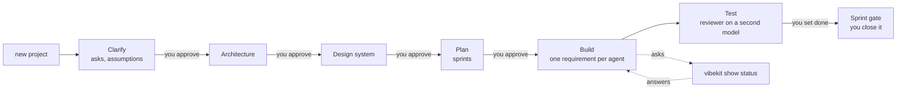

<p align="center">
  
</p>

# VibeKit

**Agents write the code. A person decides every question that matters.**

Coding agents are fast, and they guess. VibeKit puts one folder in your repo, `vibekit/`, that every agent reads: what the app is, what agents may and may not do, what your words mean, what has been decided, and what is next. An agent that lacks information writes an ask and stops. It never fills a gap with a guess. Between every stage is a gate: a line a human writes. Nothing advances itself.


[](https://pershanthenm.github.io/vibekit/)
[](https://github.com/Pershanthenm/vibekit/releases/tag/v0.1.0-alpha)

**Site:** [pershanthenm.github.io/vibekit](https://pershanthenm.github.io/vibekit/) · **Release:** [VibeKit Alpha](https://github.com/Pershanthenm/vibekit/releases/tag/v0.1.0-alpha)

VibeKit is a Claude Code plugin and a CLI with no runtime dependencies. It works with Claude Code, Cursor, Codex and any MCP client, because everything it enforces is a Markdown file in git.

## Purpose

The first version is easy to get. The mess starts the next morning, when nobody can say what was decided, what was guessed, or why a line is there. VibeKit is the loop after that: a person still decides, evidence still has to match a commit, and you can still ask why any line of code exists.

1. **Start from what the business wrote** — a description or a requirements document, sectioned and cited. An existing codebase is imported, not ignored.
2. **Ask before assuming.** Unknowns become asks with ids. What cannot be asked becomes an assumption with a blast radius, not a silent guess.
3. **Build one requirement per agent**, on its own branch, with failing tests first. `vibekit verify` writes the exit codes in. A reviewer on a second model writes the verdict. A person sets `done`.

## What it does

Six things the folder, the CLI and the phone board are built around.

- **Asks, not guesses.** An agent that lacks a fact writes an ask with an id and stops.
- **Gates only you close.** Between every stage is a line a person writes. A tap on the phone is still a commit with your name on it.
- **Evidence on the commit.** `vibekit verify` writes the exit code into the requirement. `tested` is refused without it.
- **Why any line exists.** `show why src/x.js:12` walks the requirement, the ask, the assumption, the review.
- **Several agents, one folder.** `run` works lanes in parallel. A crash or a tool switch picks up the same checkpoint.
- **The live board in your pocket.** `vibekit tracker` puts the sprint behind a QR code.

Already have a folder? `vibekit new project --import .` reads it. Nothing is thrown away so you can start again.

## Watch it work. From anywhere.

Agents run for hours. You shouldn't have to sit there. `vibekit tracker` puts a live board behind a link. Scan the QR code and it's on your phone — what's building, what's blocked, what's waiting on you, what it's cost so far.

```
Sprint 3 · Lists and tasks · 2 of 5 done

▶ Creating a list                    Claude Code · 8 min
  Writing the code · tests failing, as expected

▶ Marking a task done                Cursor · 3 min
  Working out the approach

⏸ Assigning a task to a teammate
  Waiting on your answer about people who leave a team

Spent R 88 of R 900 this sprint
```

No ids, no step counters. "Creating a list", not `REQ-007 step 4/5`. You can act from it: answer the question, approve a gate, reorder the sprint. Every tap is a commit with your name on it. Send the link to a client. It's a Cloudflare tunnel behind a login, so the QR code is safe on a wall.

## Several agents. No collisions.

One agent at a time is a waiting game. `vibekit run` works several pieces at once, across whatever tools you've got.

```
Lane A  Creating a list           Claude Code (seat)
Lane B  Marking a task done       Cursor (seat)
Queue   3 more, waiting on these
Review  1 running, different model
```

Mix tools freely. They read the same folder, so a checkpoint written in one is picked up by another. Three rules stop the mess: one job per agent, one branch, one folder each; never two agents on the same entity; a blocked lane blocks only itself. Reviews run alongside. Two lanes is the default. Four is about the limit, and VibeKit tells you rather than letting you find out.

## Stop paying premium rates for scaffolding

Your best model doesn't need to write test fixtures. VibeKit sends each piece to the cheapest thing that does it well.

| The work | Runs on |
|---|---|
| Understanding a brief, architecture, planning | Your best model |
| Building a normal feature | A mid-tier model |
| Small fixes, test data, docs, changelogs, routine checks | A cheap model |
| Secret scanning, parsing, matching | Your own machine. Free |

Reviews are never cheaper than the work they check — the reviewer always runs a tier above the implementer, on a different model. Seats you already pay for go first. Metered models only get used for what a seat can't do. You see the bill before you spend it, and afterwards what you wasted — usually around a third — with every line naming the fix. Better questions are cheaper than cheaper models.

## The honest version

VibeKit is an alpha built by one person. Parts of it are rough. The bet is that a year from now you can still say why a line is there, what it cost, and who closed the gate.

## The helpers

Twenty slash commands, one per CLI verb you would type yourself. Type `/vibekit:` in Claude Code and the list completes. Each one asks with a picker, not a prompt: where a project lives, which project to work on, which answer to an analyst's question, whether to approve a gate. You choose; you type only what nobody could have listed. They stop the agent when a person is needed, and they keep going after the code is written. The same verbs as the CLI, so Cursor, Codex and an MCP client are never on a different workflow.

| Helper | What it does |
|---|---|
| `/vibekit:setup` | Once, after install: where projects live, who you are, which provider and token |
| `/vibekit:new-project` | Start here. Name, platforms, what it is; then the repository, created for you or linked |
| `/vibekit:new-brs` | No requirements document? Five questions, answers to pick from, and the analyst starts from it |
| `/vibekit:use-project` | Pick the project to work on from the ones on this machine |
| `/vibekit:answer` | Everything waiting on you, one question at a time, by picking |
| `/vibekit:show-status` | Where everything stands, in words, then what to do about it |
| `/vibekit:run-sprint` | Whatever the current gate allows |
| `/vibekit:clarify` | Asks first, with the choices. Assumptions get ids. |
| `/vibekit:plan-project` | The sprints, in dependency order, for a person to approve |
| `/vibekit:plan-sprint` | What runs in which lane, and why |
| `/vibekit:new-sprint` | Begin the next sprint; the last one closes at its gate |
| `/vibekit:build` | One requirement, one branch, evidence |
| `/vibekit:run-check` | Every rule the standards state, mechanically |
| `/vibekit:run-review` | Second model. A person sets done. |
| `/vibekit:new-feature` | Add work without a new planning pile |
| `/vibekit:new-bug` | A defect is a requirement with its failing test |
| `/vibekit:new-hotfix` | Production is down. Stay small. |
| `/vibekit:show-plan` | Sprints, pieces of work, pace, approval |
| `/vibekit:show-why` | Why this line of code exists |
| `/vibekit:analyze` | Explain a codebase back. Changes nothing. |

## The first run

In an empty folder, `vibekit` opens with one question: what are you building? Not a logo, not a menu, not a list of tools to pick from. Type a sentence or two, or drop a requirements document on it.

```
  Before I build anything, I need to understand what you want.

  What are you building?

  ▏ A shared list for a team that leaves.
  ⏎ when you're done  ·  or drop a requirements document here
```

It then works out which coding tools you have — Claude Code, Cursor, Codex, Gemini, Copilot, Windsurf, Cline, Zed, Aider, Amazon Q — and writes a pointer file for every one of them, plus `AGENTS.md` for the ones you have not installed yet. Setup is something it tells you about afterwards, in three lines, not something it asks you to configure.

```
  Got it.

  Reading what's here     nothing here yet — starting from your description
  Setting up              Claude Code, Cursor — and AGENTS.md for the rest
  Checking                nothing existing was changed

  Now — 6 questions. 4 of them change the shape of the app.
```

Then the questions that change the shape of the app, one per screen, with options where they exist and "I don't know" always among them. A don't-know is recorded as an assumption with a confidence and a blast radius, which is a better outcome than a silent guess.

```
  1 of 6                                              4 change the shape

  Where will people use it?

  This decides the architecture, the kinds of test, and whether there
  is a design stage at all. Changing it later means a different front end.

  ▸ 1   In a web browser
    2   On their phones (iOS and Android)
    3   Both: a browser and a phone app
    4   It is an API; something else has the screens
    5   On the command line

    ?   I don't know          records it as a guess for you to check

  ↑↓ move  ⏎ choose  t type something else  esc back
```

Inside Claude Code or any coding agent it never blocks: each run prints one question as Markdown and exits, and the next run carries the answer (`vibekit 2`, or `vibekit "in your own words"`). In CI or a pipe it prints one fact per line. `--mode agent|plain|full` forces a surface so you can see what an agent sees. The site plays the same screens: [pershanthenm.github.io/vibekit/#first-run](https://pershanthenm.github.io/vibekit/#first-run).

## Two commands a day

```bash
vibekit show status   # what needs you, across every project, most blocking first
vibekit run           # work the current sprint with several agents at once
```

`vibekit action answer` walks you through the questions one at a time. Or none of this, and the tracker on your phone.

## The flow



1. **Start.** `vibekit new project` — name it, say where it lives, say what you want or hand over the requirements document. It is redacted before it touches git.
2. **Clarify.** The analyst asks about everything the source does not settle, ten questions a round, in plain terms. What it cannot ask becomes an assumption with an id and a confidence.
3. **Architecture, design, plan.** Each proposed with reasons; you approve each with a line in the file. The plan is sprints in dependency order, walking skeleton first.
4. **Build.** One requirement per agent per branch. Approach before code, failing tests per criterion, `vibekit verify` captures the exit codes, `tested` is refused without them.
5. **Test.** A reviewer on a different model maps every criterion to a named test and writes the verdict. A person sets `done`. A person closes the sprint.

## The commands

Eight verbs, each followed by what you want it to act on. Verb first, always. The name is optional: after `use project`, everything applies there. A bare verb lists what it takes.

| Verb | Means | Takes |
|---|---|---|
| `new` | Start something that did not exist | `new project "Hello World"` · `new sprint` · `new feature "…"` · `new bug "…" --test <path>` · `new hotfix "…"` · `new repo` · `new brs` |
| `use` | Switch what I am working on | `use project "Hello World 2"` · `use sprint 2` · `use` (pick from a list) |
| `show` | Tell me something, change nothing | `show` · `show project` · `show plan` · `show sprint` · `show status` · `show cost` · `show security` · `show backlog` · `show docs` · `show why src/x.js:12` · `show team` · `show migration` · `show differences` — all take `--all` and `--json` |
| `plan` | Decide the order of work | `plan project [--approve --by "<name>"]` · `plan sprint [--order …] [--defer …]` |
| `run` | Do work now | `run sprint [--lanes N] [--until blocked\|gate] [--headless]` · `run check` · `run scan` · `run review` · `run docs` · `run` |
| `analyze` | Tell me about a codebase, change nothing | `analyze .` · `analyze <git url>` · `--depth quick\|standard\|deep` · `--focus security\|cost\|migration\|quality` · `--compare <path>` · `--pdf --brand <site>` |
| `migrate` | Move software you already have | `migrate upgrade "…"` · `migrate replatform "…"` · `migrate decompose "…"` · `migrate status` · `migrate next` |
| `verify` | Prove the new behaves like the old | `verify` · `verify --live` · `verify --replay <log>` · `verify --data` · `verify --report` |

Plus three more: `stop`, `resume`, and `ship release 1.2.0` · `ship rollback v1.1.0` · `ship undo REQ-014`. And the extras: `settings`, `design add <url>`, `tracker`, `ext add <name>`, `completion <shell>`.

The folder's own verbs (`req`, `ask`, `start`, `verify`, `check`, `init`, `ingest`, `skills`, `tools`, `serve`) are what agents, hooks and CI call, and are unchanged. The earlier grammar (`project new`, `sprint run`, `action`) still works as an alias of the command above, so nothing that a script or a hook already calls breaks. `vibekit --help` lists everything; bare `vibekit` says where you are and what needs you.

Shell completion completes your projects, sprints, releases and files, not just the grammar: `vibekit completion install`.

## What it enforces, mechanically

- **Closed vocabulary.** An entity or field not in `entities.md` is refused; the agent proposes it with an ask.
- **Definition of ready and done.** EARS criteria that parse, a size, a source, a security note for M and L; a named passing test per criterion, review, evidence for this commit, no open asks.
- **Evidence, not claims.** `vibekit verify` writes commit, suite and exit code into the requirement. Red, dirty, another commit, or a skipped test: `tested` is refused.
- **Roles.** The implementer cannot edit `standards/`; the reviewer cannot write code; nobody but a person sets `done` or closes a sprint. `vibekit serve` enforces the loads manifest, the writes list and the allowed commands over MCP; `--sandbox` runs every command in a container.
- **Git hooks.** No commit straight onto `main`; a commit on `req/*` carries its requirement id and trailer; no staged secret, key or personal data; no force push to a protected branch.
- **Bugs.** A bug is a requirement with a severity, who found it, and a reproducing test. No test, no bug. An agent may not set severity above medium and may not close one. Fixing is three jobs — assess, fix, test — and the verdict is one word.
- **Sprint gate.** Everything done, checks green, no high security finding, documents regenerated, reports produced, lessons proposed, and a person's name.
- **Convergence.** Work is finished when a check says it stopped changing, not when the code was written; oscillation is caught on the spot.

## Outside knowledge and tools

Everything from outside adds capability and never weakens a guarantee:

- **MCP servers a project consumes** — declared in `vibekit/agents/servers.yml` as an allow-list of tools, the roles that may call them, the highest data class they may see, a per-session budget. A remote server has a `url:`; a local one has a `command:` (words, never a shell string) and is launched on stdio for each call with its credential in the one variable `token-env:` names. Agents reach both through `vibekit serve`'s `vibekit_call`, which enforces all of it at the boundary and logs every call; credentials live in machine settings (`vibekit settings server <id> <token>`), never in the folder. `vibekit run check --servers` before a sprint.
- **Skills that ship** — 27 short engineering skills (test-driven development, adversarial review, API design, schema design, zero-downtime migration, Docker, CI pipelines, observability, SLOs, feature flags, secrets hygiene, threat modelling, incident response and more) are written into every new project under `skills/lib/vibekit/` as generated files: indexed by trigger, tested, 100 to 400 tokens each, and refused to agents that try to edit them. They are the lowest rung of the override chain, so a team's own copy always wins: `vibekit skills adopt <name>` makes that copy. `vibekit skills reference <name>` prints the full source each was distilled from (claude-skills, MIT; see `library/SOURCES.md`). `vibekit init --no-library` opts out.
- **The catalogue** — the other 374 skills from the same repository, in 16 domains (engineering, marketing, product, finance, compliance, research and more), ship as data in `library/catalogue/` and are indexed only when a project enables them: `vibekit skills catalogue` lists the domains, `vibekit skills catalogue <word>` searches, `vibekit skills enable <name|domain>` writes the chosen ones into the folder with a short lead as the body and the full text as the reference, and refuses an enable that would put the always-loaded folder over its cap. `vibekit skills disable` takes them out again.
- **Skills from a repository** — `vibekit tools skills import <repo>`: identity dropped, opinions that govern code flagged rather than imported, substantial code lifted into pattern files, triggers guessed and marked low confidence, provenance and licence recorded, near-duplicates made disjoint.
- **Extensions** — `vibekit ext add <url>`: data only (skills, declarative checks, stage prompts, documents, servers), never code; pinned to a commit; the always-loaded cost declared and verified; an install that would breach the project's cap refused; the same check from two extensions refused; recorded in `profile.md`. `ext update` shows the diff first. `ext verify` runs the rules before you publish, then installs the extension against the three fixture briefs and diffs the questions, findings and folder against `fixtures/golden.json`; only the extension's own checks may move them.
- **Signed releases** — `vibekit ext keygen` makes an Ed25519 pair; `vibekit ext sign ./kit --key vibekit-ext.key` writes `extension.sig` over a digest of every file. An installer trusts a publisher with `vibekit settings trust <name> <public-key>`; `vibekit settings require-signed true` refuses anything unsigned, tampered or from an unknown key. A team's own kit needs none of this; anything published outside the organisation does.

## From your phone

`vibekit tracker <project>` — from anywhere on the machine — finds the project by name, opens a Cloudflare tunnel and prints a QR code to scan; `--no-tunnel` keeps it local. `vibekit serve --tracker` puts Cloudflare Access in front and maps logins to `agents/humans.md`. The page is installable and readable offline; decisions made offline queue and replay, re-confirmed if the target moved; each is a commit on `tracker/<user>` with §51 trailers.

## Security

Redaction on ingest; entropy-scored secret detection on ingest, commit, memory and workflow; an SSRF guard on everything that fetches; dependency audit with licence and registry policy; prompt-injection shapes flagged; owner-only file modes for tokens and registries; a sandbox per session with an egress proxy option; and `vibekit run scan`, which measures the application against OWASP ASVS, Top 10, API Top 10, CIS Docker, POPIA/GDPR, PCI DSS and NIST SSDF, counts what needs a person honestly, and turns findings into bugs. Extensions are data only — never code.

## Install

Node.js 20+ and Git. Docker or Podman for `serve --sandbox`; `cloudflared` for tunnels.

### CLI (every tool)

From the [Alpha release](https://github.com/Pershanthenm/vibekit/releases/tag/v0.1.0-alpha):

```bash
npm install -g https://github.com/Pershanthenm/vibekit/releases/download/v0.1.0-alpha/vibekit-0.1.0-alpha.tgz
vibekit version
```

Or from this repository:

```bash
git clone https://github.com/Pershanthenm/vibekit.git
npm install -g ./vibekit/plugin
```

Then, in a project: `vibekit new project`. On a repo you already have: `vibekit new project --import .`.

### Claude Code

The plugin adds the slash commands (`/vibekit:setup`, `/vibekit:new-project`, `/vibekit:new-brs`, `/vibekit:use-project`, `/vibekit:answer`, `/vibekit:show-status`, `/vibekit:run-sprint`, `/vibekit:clarify`, `/vibekit:plan-project`, `/vibekit:plan-sprint`, `/vibekit:new-sprint`, `/vibekit:build`, `/vibekit:run-check`, `/vibekit:run-review`, `/vibekit:new-feature`, `/vibekit:new-bug`, `/vibekit:new-hotfix`, `/vibekit:show-plan`, `/vibekit:show-why`, `/vibekit:analyze`) and hooks. The CLI still has to be on PATH.

```text
/plugin marketplace add Pershanthenm/vibekit
/plugin install vibekit
/reload-plugins
```

Then `/vibekit:setup` once: it records where your projects live, your name for approvals, and your GitHub, GitLab or Azure DevOps organisation and token, so no helper asks again. From then on `vibekit new repo` (or `new project --where remote`) creates the repository at the provider, writes the pipeline in that provider's dialect, pushes, and on Azure DevOps registers the pipeline; branch policies, permissions and secrets stay at the provider. Later, `/plugin update vibekit` pulls a new release; `/reload-plugins` alone re-reads what is already installed.

Then `cd your-project && vibekit new project`.

### Cursor and Cursor CLI

`new project` writes `.cursorrules`. Attach the MCP server so reads, writes and commands are enforced — in the Cursor app and in the Cursor CLI (`cursor-agent`).

```json
{
  "mcpServers": {
    "vibekit": {
      "command": "vibekit",
      "args": ["serve", "--stdio"]
    }
  }
}
```

Save that as `~/.cursor/mcp.json`. Add `--sandbox` to the args if you want a container per session.

### Codex

Codex reads `AGENTS.md`, which `new project` writes. Point its MCP config at:

```bash
vibekit serve --stdio
```

### Other CLI agents

OpenCode, Aider, or any MCP client: they read `AGENTS.md`, or they speak JSON-RPC on stdio. Git hooks still apply.

```bash
cd your-project && vibekit new project
vibekit serve --stdio
```

See [ONBOARDING.md](ONBOARDING.md) and [docs/MULTI-EDITOR.md](docs/MULTI-EDITOR.md).

## Documentation

| Where | For |
|---|---|
| [pershanthenm.github.io/vibekit](https://pershanthenm.github.io/vibekit/) | Site: the loop, the commands, tracker, lanes, cost |
| [GUIDE.md](GUIDE.md) | Working day to day |
| [ONBOARDING.md](ONBOARDING.md) | Installing on a machine |
| [docs/BROWNFIELD.md](docs/BROWNFIELD.md) | An existing codebase: `project import` |
| [docs/MULTI-EDITOR.md](docs/MULTI-EDITOR.md) | Claude Code, Cursor, Codex and others on one project |
| [docs/GITHUB.md](docs/GITHUB.md) | Publishing the repository for a team: protection, CODEOWNERS, CI, the first release |

## Development

```bash
cd plugin
npm test            # the suite
npm run simulate    # seven end-to-end walks against the built binary
npm run recovery    # §60 recovery fixture: kill a session, resume, require tested
npm run test:repeat # the suite three times, for flakes
npm run golden:check # the three fixture briefs (§32) against fixtures/golden.json; `npm run golden` records an intended change
```

## Status

Alpha. The first version. The suite, the simulation, the recovery fixture and the golden fixtures run in CI on Windows, macOS and Linux. Not built here: the desktop app (§70) and the provider integrations that open pull requests through GitHub's or GitLab's API (§51); the tracker page is the browser surface and the CLI does everything else.

## License

No licence has been chosen for VibeKit yet. Third-party content keeps its own licence: see [THIRD_PARTY_NOTICES.md](plugin/THIRD_PARTY_NOTICES.md).
