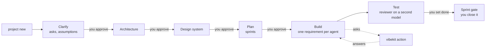

<p align="center">
  
</p>

# VibeKit

**Spec-driven development for coding agents, with a person deciding every question that matters.**

Coding agents are fast, and they guess. VibeKit puts one folder in your repo, `vibekit/`, that every agent reads: what the app is, what agents may and may not do, what your words mean, what has been decided, and what is next. An agent that lacks information writes an ask and stops. It never fills a gap with a guess. Between every stage is a gate: a line a human writes. Nothing advances itself.


[](https://pershanthenm.github.io/vibekit/)
[](https://github.com/Pershanthenm/vibekit/releases/tag/v0.1.0-alpha)

**Site:** [pershanthenm.github.io/vibekit](https://pershanthenm.github.io/vibekit/) · **Release:** [VibeKit Alpha](https://github.com/Pershanthenm/vibekit/releases/tag/v0.1.0-alpha)

VibeKit is a Claude Code plugin and a CLI with no runtime dependencies. It works with Claude Code, Cursor, Codex and any MCP client, because everything it enforces is a Markdown file in git. Inspired by [Spec Kit](https://github.com/github/spec-kit) and [Agent OS](https://github.com/buildermethods/agent-os).

## Purpose

Other tools help you write a spec and then leave you alone. VibeKit is the operating loop after that: a person still decides, evidence still has to match a commit, and you can still ask why any line of code exists.

1. **Start from what the business wrote** — a description or a requirements document, sectioned and cited. An existing codebase is imported, not ignored.
2. **Ask before assuming.** Unknowns become asks with ids. What cannot be asked becomes an assumption with a blast radius, not a silent guess.
3. **Build one requirement per agent**, on its own branch, with failing tests first. `vibekit verify` writes the exit codes in. A reviewer on a second model writes the verdict. A person sets `done`.

## Why not just Spec Kit?

[Spec Kit](https://github.com/github/spec-kit) gets you to a first version fast, and that's genuinely the hard part starting out. Describe what you want, get a spec, a plan, a task list and working code. [Agent OS](https://github.com/buildermethods/agent-os) solves a different problem well — it learns how your team already writes code and feeds the right conventions to the agent, so you stop repeating yourself in every prompt.

Both are good. VibeKit borrows from both and maps onto the same steps. **The difference is how far each one takes you.** Spec Kit and Agent OS hand you a first version. VibeKit stays for the whole life of the project.

Already using either? `vibekit project import .` reads what you have. Nothing is lost. From Spec Kit, `vibekit project import . --speckit` reads `memory/constitution.md`, `specs/`, `plan.md` and `tasks.md`.

**✓** does it · **◐** partly · **—** doesn't, and isn't trying to

### Before you build

| | Spec Kit | Agent OS | VibeKit |
|---|---|---|---|
| Turn an idea into a spec | ✓ | ◐ | ✓ |
| Read a real requirements document | — | — | ✓ |
| Ask before assuming | ◐ | ◐ | ✓ |
| Track every guess and what's riding on it | — | — | ✓ |
| Learn your team's conventions | — | ✓ | ✓ |
| Decide whether to build it at all | — | — | ✓ |
| Work on a codebase you already have | — | ✓ | ✓ |

### While you build

| | Spec Kit | Agent OS | VibeKit |
|---|---|---|---|
| Break work into tasks | ✓ | ◐ | ✓ |
| Write the code | ✓ | ◐ | ✓ |
| Run several agents at once | — | — | ✓ |
| Watch it live, from your phone | — | — | ✓ |
| Prove the tests actually passed | — | — | ✓ |
| Review on a second model | — | — | ✓ |
| Survive a crash or a tool switch | — | — | ✓ |
| Keep small changes small | — | ◐ | ✓ |
| Use cheap models where they're enough | — | — | ✓ |
| Cap what it spends | — | — | ✓ |

### After it ships

| | Spec Kit | Agent OS | VibeKit |
|---|---|---|---|
| Say why any line exists | — | — | ✓ |
| Catch the spec drifting from the code | — | — | ✓ |
| Score security against OWASP, POPIA, CIS | — | — | ✓ |
| Generate HLD, LLD and diagrams in your brand | — | — | ✓ |
| Hand a client something to approve | — | — | ✓ |
| Undo a shipped feature cleanly | — | — | ✓ |
| Show what the agents cost, and what was wasted | — | — | ✓ |
| Learn from what went wrong | — | — | ✓ |
| Onboard someone without you in the room | ◐ | ◐ | ✓ |

The pattern is the point. Nobody loses the first table by much. The third one is empty for everything except VibeKit, because the others were never built for it — they're first-pass tools, and they say so.

## Watch it work. From anywhere.

Agents run for hours. You shouldn't have to sit there. `vibekit tracker` puts a live board behind a link. Scan the QR code and it's on your phone — what's building, what's blocked, what's waiting on you, what it's cost so far.

```
Sprint 3 · Lists and tasks · 2 of 5 done

▶ Creating a list                    Claude Code · 8 min
  Writing the code · tests failing, as expected

▶ Marking a task done                Cursor · 3 min
  Working out the approach

⏸ Assigning a task to a teammate
  Waiting on your answer about people who leave a team

Spent R 88 of R 900 this sprint
```

No ids, no step counters. "Creating a list", not `REQ-007 step 4/5`. You can act from it: answer the question, approve a gate, reorder the sprint. Every tap is a commit with your name on it. Send the link to a client. It's a Cloudflare tunnel behind a login, so the QR code is safe on a wall.

## Several agents. No collisions.

One agent at a time is a waiting game. `vibekit sprint run` works several pieces at once, across whatever tools you've got.

```
Lane A  Creating a list           Claude Code (seat)
Lane B  Marking a task done       Cursor (seat)
Queue   3 more, waiting on these
Review  1 running, different model
```

Mix tools freely. They read the same folder, so a checkpoint written in one is picked up by another. Three rules stop the mess: one job per agent, one branch, one folder each; never two agents on the same entity; a blocked lane blocks only itself. Reviews run alongside. Two lanes is the default. Four is about the limit, and VibeKit tells you rather than letting you find out.

## Stop paying premium rates for scaffolding

Your best model doesn't need to write test fixtures. VibeKit sends each piece to the cheapest thing that does it well.

| The work | Runs on |
|---|---|
| Understanding a brief, architecture, planning | Your best model |
| Building a normal feature | A mid-tier model |
| Small fixes, test data, docs, changelogs, routine checks | A cheap model |
| Secret scanning, parsing, matching | Your own machine. Free |

Reviews are never cheaper than the work they check — the reviewer always runs a tier above the implementer, on a different model. Seats you already pay for go first. Metered models only get used for what a seat can't do. You see the bill before you spend it, and afterwards what you wasted — usually around a third — with every line naming the fix. Better questions are cheaper than cheaper models.

## The honest version

Spec Kit is free, mature and backed by GitHub. Agent OS is the best thing going for standards. Both have real users today. VibeKit is an alpha built by one person and parts of it are rough.

If you want a clean first version and you're happy driving from there, use Spec Kit. If agents keep ignoring how your team writes code, use Agent OS. They're not mutually exclusive — Agent OS standards import straight into VibeKit as skills.

VibeKit is for the project where somebody asks, a year later, why a line is there — and you'd like to answer in a second rather than an afternoon.

## The helpers

Spec Kit’s slash commands and `.specify` helper scripts walk specify → plan → tasks → implement. VibeKit’s helpers are the same idea with a different centre of gravity: they stop the agent when a person is needed, and they keep going after the code is written.

| Spec Kit | VibeKit | What changes |
|---|---|---|
| `/speckit.constitution` | `standards/` + `vibekit check` | Principles become rules that fire |
| `/speckit.specify` | `/vibekit.new-feature` · `project new` | The brief is a source, not a one-shot prompt |
| `/speckit.clarify` | `/vibekit.clarify` · `vibekit action` | An inbox, not a single pass |
| `/speckit.plan` | architecture and plan gates | You approve with a line in the file |
| `/speckit.tasks` | `vibekit sprint plan` | Sizes, walking skeleton, cost forecast |
| `/speckit.implement` | `/vibekit.build` · `sprint run` | One requirement per agent; evidence required |
| `/speckit.analyze` | `vibekit check` · `vibekit drift` | Mechanical, and it runs in CI |
| `/speckit.converge` | `/vibekit.review` · sprint close | Second model; a person sets `done` |
| — | `/vibekit.why` | The chain Spec Kit does not keep |
| — | `/vibekit.hotfix` · `/vibekit.status` · `/vibekit.next` | Small work stays small; the next step is a command |

The slash commands are a thin layer over the CLI, so Claude Code, Cursor, Codex and an MCP client are never on different workflows.

## Two commands a day

```bash
vibekit action        # everything waiting on you, across every project, most blocking first
vibekit sprint run    # work the current sprint with several agents at once
```

`vibekit action answer` walks you through the questions one at a time. Or none of this, and the tracker on your phone.

## The flow



1. **Start.** `vibekit project new` — name it, say where it lives, say what you want or hand over the requirements document. It is redacted before it touches git.
2. **Clarify.** The analyst asks about everything the source does not settle, ten questions a round, in plain terms. What it cannot ask becomes an assumption with an id and a confidence.
3. **Architecture, design, plan.** Each proposed with reasons; you approve each with a line in the file. The plan is sprints in dependency order, walking skeleton first.
4. **Build.** One requirement per agent per branch. Approach before code, failing tests per criterion, `vibekit verify` captures the exit codes, `tested` is refused without them.
5. **Test.** A reviewer on a different model maps every criterion to a named test and writes the verdict. A person sets `done`. A person closes the sprint.

## The commands

| Group | Commands |
|---|---|
| **Projects** | `project new` · `project select` · `project status [--all]` · `project import <repo>` · `project assess "<idea>"` · `project stop` · `project resume` |
| **Sprints** | `sprint plan [--cost]` · `sprint start` · `sprint run [--lanes N] [--until blocked]` · `sprint status` · `sprint close --by "<name>"` |
| **Action needed** | `action` · `action answer` (a walk-through) · `action answer <n> "<answer>" …` · `action export` / `action answer --from answers.md` · `tracker <project>` |
| **Work** | `feature add "<text>"` · `bug "<text>" --test <path>` · `bug assess|fix|test BUG-001` · `hotfix "<text>"` · `review` · `why <file:line>` |
| **Design** | `design` · `design add <url|image>` · `design preview` · `design apply` · `design feedback "<text>"` |
| **Quality** | `security scan [--url]` · `check [--ci] [--security] [--deps] [--parity] [--servers] [--budget]` · `docs` · `report build|budget|security` |
| **Shipping** | `release [<version>]` · `rollback <tag>` · `undo <id>` |
| **Setup** | `init` · `team` · `cost` · `settings [<key> <value> | tiers | frameworks | server | trust]` · `ext add|list|update|remove|verify|sign|keygen` · `tools skills import <repo>` · `tools rates` |

Every older verb (`next`, `pause`, `understand`, `arch-docs`, `quick`, `revert`, `config`) still works as an alias of the command above. `vibekit --help` lists everything; bare `vibekit` says what to do next in this folder.

## What it enforces, mechanically

- **Closed vocabulary.** An entity or field not in `entities.md` is refused; the agent proposes it with an ask.
- **Definition of ready and done.** EARS criteria that parse, a size, a source, a security note for M and L; a named passing test per criterion, review, evidence for this commit, no open asks.
- **Evidence, not claims.** `vibekit verify` writes commit, suite and exit code into the requirement. Red, dirty, another commit, or a skipped test: `tested` is refused.
- **Roles.** The implementer cannot edit `standards/`; the reviewer cannot write code; nobody but a person sets `done` or closes a sprint. `vibekit serve` enforces the loads manifest, the writes list and the allowed commands over MCP; `--sandbox` runs every command in a container.
- **Git hooks.** No commit straight onto `main`; a commit on `req/*` carries its requirement id and trailer; no staged secret, key or personal data; no force push to a protected branch.
- **Bugs.** A bug is a requirement with a severity, who found it, and a reproducing test. No test, no bug. An agent may not set severity above medium and may not close one. Fixing is three jobs — assess, fix, test — and the verdict is one word.
- **Sprint gate.** Everything done, checks green, no high security finding, documents regenerated, reports produced, lessons proposed, and a person's name.
- **Convergence.** Work is finished when a check says it stopped changing, not when the code was written; oscillation is caught on the spot.

## Outside knowledge and tools

Everything from outside adds capability and never weakens a guarantee:

- **MCP servers a project consumes** — declared in `vibekit/agents/servers.yml` as an allow-list of tools, the roles that may call them, the highest data class they may see, a per-session budget. A remote server has a `url:`; a local one has a `command:` (words, never a shell string) and is launched on stdio for each call with its credential in the one variable `token-env:` names. Agents reach both through `vibekit serve`'s `vibekit_call`, which enforces all of it at the boundary and logs every call; credentials live in machine settings (`vibekit settings server <id> <token>`), never in the folder. `vibekit check --servers` before a sprint.
- **Skills from a repository** — `vibekit tools skills import <repo>`: identity dropped, opinions that govern code flagged rather than imported, substantial code lifted into pattern files, triggers guessed and marked low confidence, provenance and licence recorded, near-duplicates made disjoint.
- **Extensions** — `vibekit ext add <url>`: data only (skills, declarative checks, stage prompts, documents, servers), never code; pinned to a commit; the always-loaded cost declared and verified; an install that would breach the project's cap refused; the same check from two extensions refused; recorded in `profile.md`. `ext update` shows the diff first. `ext verify` runs the rules before you publish, then installs the extension against the three fixture briefs and diffs the questions, findings and folder against `fixtures/golden.json`; only the extension's own checks may move them.
- **Signed releases** — `vibekit ext keygen` makes an Ed25519 pair; `vibekit ext sign ./kit --key vibekit-ext.key` writes `extension.sig` over a digest of every file. An installer trusts a publisher with `vibekit settings trust <name> <public-key>`; `vibekit settings require-signed true` refuses anything unsigned, tampered or from an unknown key. A team's own kit needs none of this; anything published outside the organisation does.

## From your phone

`vibekit tracker <project>` — from anywhere on the machine — finds the project by name, opens a Cloudflare tunnel and prints a QR code to scan; `--no-tunnel` keeps it local. `vibekit serve --tracker` puts Cloudflare Access in front and maps logins to `agents/humans.md`. The page is installable and readable offline; decisions made offline queue and replay, re-confirmed if the target moved; each is a commit on `tracker/<user>` with §51 trailers.

## Security

Redaction on ingest; entropy-scored secret detection on ingest, commit, memory and workflow; an SSRF guard on everything that fetches; dependency audit with licence and registry policy; prompt-injection shapes flagged; owner-only file modes for tokens and registries; a sandbox per session with an egress proxy option; and `vibekit security scan`, which measures the application against OWASP ASVS, Top 10, API Top 10, CIS Docker, POPIA/GDPR, PCI DSS and NIST SSDF, counts what needs a person honestly, and turns findings into bugs. Extensions are data only — never code.

## Install

Node.js 20+ and Git. Docker or Podman for `serve --sandbox`; `cloudflared` for tunnels.

### CLI (every tool)

From the [Alpha release](https://github.com/Pershanthenm/vibekit/releases/tag/v0.1.0-alpha):

```bash
npm install -g https://github.com/Pershanthenm/vibekit/releases/download/v0.1.0-alpha/vibekit-0.1.0-alpha.tgz
vibekit version
```

Or from this repository:

```bash
git clone https://github.com/Pershanthenm/vibekit.git
npm install -g ./vibekit/plugin
```

Then, in a project: `vibekit project new`. On a repo you already have: `vibekit project import .`.

### Claude Code

The plugin adds slash commands (`/vibekit.status`, `/vibekit.next`, `/vibekit.new-feature`, `/vibekit.hotfix`, `/vibekit.clarify`, `/vibekit.build`, `/vibekit.review`, `/vibekit.why`) and hooks. The CLI still has to be on PATH.

```text
/plugin marketplace add Pershanthenm/vibekit
/plugin install vibekit
/reload-plugins
```

Then `cd your-project && vibekit project new`.

### Cursor and Cursor CLI

`project new` writes `.cursorrules`. Attach the MCP server so reads, writes and commands are enforced — in the Cursor app and in the Cursor CLI (`cursor-agent`).

```json
{
  "mcpServers": {
    "vibekit": {
      "command": "vibekit",
      "args": ["serve", "--stdio"]
    }
  }
}
```

Save that as `~/.cursor/mcp.json`. Add `--sandbox` to the args if you want a container per session.

### Codex

Codex reads `AGENTS.md`, which `project new` writes. Point its MCP config at:

```bash
vibekit serve --stdio
```

### Other CLI agents

OpenCode, Aider, or any MCP client: they read `AGENTS.md`, or they speak JSON-RPC on stdio. Git hooks still apply.

```bash
cd your-project && vibekit project new
vibekit serve --stdio
```

See [ONBOARDING.md](ONBOARDING.md) and [docs/MULTI-EDITOR.md](docs/MULTI-EDITOR.md).

## Documentation

| Where | For |
|---|---|
| [pershanthenm.github.io/vibekit](https://pershanthenm.github.io/vibekit/) | Site: coverage vs Spec Kit and Agent OS, tracker, lanes, cost |
| [GUIDE.md](GUIDE.md) | Working day to day |
| [ONBOARDING.md](ONBOARDING.md) | Installing on a machine |
| [docs/BROWNFIELD.md](docs/BROWNFIELD.md) | An existing codebase: `project import` |
| [docs/MULTI-EDITOR.md](docs/MULTI-EDITOR.md) | Claude Code, Cursor, Codex and others on one project |
| [docs/GITHUB.md](docs/GITHUB.md) | Publishing the repository for a team: protection, CODEOWNERS, CI, the first release |

## Development

```bash
cd plugin
npm test            # the suite
npm run simulate    # seven end-to-end walks against the built binary
npm run recovery    # §60 recovery fixture: kill a session, resume, require tested
npm run test:repeat # the suite three times, for flakes
npm run golden:check # the three fixture briefs (§32) against fixtures/golden.json; `npm run golden` records an intended change
```

## Status

Alpha. The first version. The suite, the simulation, the recovery fixture and the golden fixtures run in CI on Windows, macOS and Linux. Not built here: the desktop app (§70) and the provider integrations that open pull requests through GitHub's or GitLab's API (§51); the tracker page is the browser surface and the CLI does everything else.

## License

No licence has been chosen for VibeKit yet. Third-party content keeps its own licence: see [THIRD_PARTY_NOTICES.md](plugin/THIRD_PARTY_NOTICES.md).
