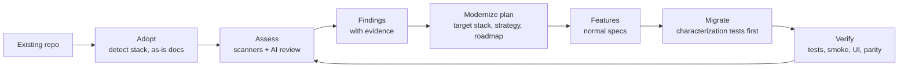

# Brownfield — assess, modernize and migrate existing codebases

- **Product:** VibeKit
- **Status:** Part 1 (Adopt) implemented. Parts 2–4 specified, not built.
- **Date:** 2026-09-11

## 1. Problem

VibeKit works well for new projects: it starts from menus and builds forward, spec by
spec. Most real work isn't greenfield. Teams inherit applications on end-of-life frameworks
(.NET Framework 4.x, Vue 2, AngularJS, Python 2, Java 8), with vulnerable dependencies, missing
tests, and architecture nobody fully remembers.

There is no way to point VibeKit at an existing codebase and answer three questions:

1. **What have we got?** Stack, versions, structure, and how healthy it is.
2. **What's wrong with it?** Security holes, vulnerable or end-of-life dependencies, licence
   conflicts, reliability and performance risks, test gaps, architecture problems.
3. **How do we get somewhere better without breaking it?** A modernization plan that runs
   through the same spec-driven, test-proven workflow as new code.

## 2. Goals

1. **Adopt** any existing repository without a rewrite: detect what's there, describe it as-is.
2. **Assess** with evidence: every issue points at a file, line or tool result. Nothing rests on
   "the AI thinks".
3. **Plan** modernization as ordinary features, ordered by risk and dependency, with the target
   stack chosen through the existing advisor.
4. **Migrate safely:** lock in current behaviour with characterization tests before changing
   anything, then prove every step with the existing evidence gates.
5. **Stop new problems:** a CI gate that fails on *new* serious findings without failing on the
   legacy baseline.

## 3. Non-goals

- Fully automatic rewrites merged without review.
- Migrating production data or deploying to production.
- Replacing specialist tools. Scanners such as Semgrep, gitleaks and OSV-Scanner do the
  detecting; VibeKit runs them, merges results, and turns them into work.
- Languages with no scanner or parser support. They get inventory and AI review only, labelled
  as such.

## 4. Users and scenarios

| Who | Scenario |
|---|---|
| Lead taking over an app | "Show me what this 8-year-old ASP.NET MVC app is, and how risky it is." |
| Team planning an upgrade | "Get us from .NET Framework 4.8 + AngularJS to .NET 9 + Vue 3, one piece at a time." |
| Security review | "List every vulnerable dependency, leaked secret and missing authorization check, ranked." |
| Everyday developer | "Before I touch this module, what are its known issues and hot spots?" |
| CI | "Fail the pull request if it introduces a new critical or high finding." |

## 5. How it fits the existing workflow



Brownfield work reuses what VibeKit already has: the **advisor** for target stack and
licences, the **security baseline** for controls to assess against, **verification, evidence and
living docs** for proof, the **subagents** for analysis, **lanes** for parallel
migration, and **memory and OpenContext** to keep what was learned.

---

## Part 1: Adopt an existing repository — implemented

**Entry point:** `vibekit adopt [--force] [--json]`.

**Behaviour**

1. **Detects the stack from the repository itself:** languages and their share of the code;
   frameworks and versions from `package.json`, `*.csproj`, `packages.config`, `pom.xml`,
   `build.gradle`, `requirements*.txt`, `pyproject.toml`, `composer.json`, `go.mod`; test
   frameworks; CI files; migration sources; container files. Dependency and build folders
   (`node_modules`, `bin`, `obj`, `vendor`, `packages`, …) are skipped so vendored code cannot
   skew the result.
2. **Writes `specs/project.json` describing the as-is state**, marked `"origin": "adopted"`.
   Commands are detected where possible; anything unknown is left **empty and flagged, never
   guessed** — including where a language preset would otherwise have supplied a default.
3. **Generates as-is docs:** `assessment/adopt.md` (what was found, and what was not, with the
   files inspected), `docs/architecture.md` from the repository structure, and
   `docs/data-model.md` with an `erDiagram` parsed from EF6 or EF Core migrations, stamped
   against those migration files.
4. **Lets work continue under the workflow.** Existing code needs no specs; new changes go
   through features as usual.

**Acceptance criteria**

- **AC-1** ✅ Given a repository with a .NET Framework 4.8 web project and an AngularJS front
  end, when adopted, then `specs/project.json` lists C# and JavaScript, ASP.NET MVC 5 on .NET
  Framework 4.8 and AngularJS 1.x, with the exact versions found in the manifests.
- **AC-2** ✅ Given a repository with no recognisable test command, when adopted, then
  `commands.test` is empty and the adopt report says so, with the files it looked at.
- **AC-3** ✅ Given EF6 migrations, when adopted, then `docs/data-model.md` contains an
  `erDiagram` generated from them and is stamped against the migration files.
- **AC-4** ⬜ Given an adopted project, when a developer edits existing code without a feature in
  progress, then the pre-edit hook blocks it, and `specs/`, `docs/` and `assessment/` stay
  writable. *(Not implemented: the hook does not yet know about `assessment/`.)*
- **AC-5** ✅ Given a repository already containing `specs/project.json`, when adopted, then
  nothing is overwritten and adopt reports what it would have changed.

**Known limitation.** `validate()` requires a non-empty `commands.test`, so `vibekit check`
reports an adopted repository that has no test command. That is deliberate — agents cannot
verify their work without one — but an adopted project is not "green" until a human supplies it.

---

## Part 2: Assess, and pick up issues — specified, not built

**Entry points:** `/vibekit:assess [path]`, `vibekit assess [--scope <path>] [--offline] [--diff]`.

**Two layers, in this order**

| Layer | What it finds | How |
|---|---|---|
| **1. Facts** (deterministic, reproducible) | Vulnerable dependencies, end-of-life runtimes, leaked secrets, common security flaws, licence conflicts, missing tests and CI, hot spots | Stack-native audits (`npm audit`, `dotnet list package --vulnerable`, `pip-audit`, `composer audit`, `govulncheck`) or OSV-Scanner; gitleaks; Semgrep community rules; endoflife.date with a bundled offline table; git churn combined with file size and complexity |
| **2. Judgement** (AI subagents, evidence required) | Missing authorization checks, unsafe error handling, N+1 queries, layering violations, risky patterns scanners miss | Subagents review the highest-risk areas first, within a budget. Every finding quotes the code it refers to, with file and line. A second pass by the reviewer subagent confirms or rejects each high or critical AI finding |

Missing scanners are installed through `vibekit setup`, or reported as skipped. The assessment
never pretends a check ran when it didn't.

**Output**, in `assessment/`: `report.md` (health score per category, top 10 risks, hot spots),
`findings.json`, `inventory.json`, `baseline.json` (fingerprints, so later runs report new, fixed
and unchanged).

`vibekit findings --to-features` groups related findings into draft features with acceptance
criteria written from the findings' evidence. They go through normal spec approval.

**Acceptance criteria**

- **AC-1** Given a dependency with a known CVE, when assessed, then `findings.json` contains a
  finding with category `dependency`, the package and version, the advisory ID, the fixed
  version, and `source: "osv-scanner"` (or the stack-native audit that found it).
- **AC-2** Given a hard-coded AWS key, when assessed, then a critical `secret` finding points at
  the file and line, and the key is redacted everywhere (first 4 characters only).
- **AC-3** Given `--offline`, when assessed, then no network requests are made, end-of-life data
  comes from the bundled table, and the report says vulnerability data may be out of date.
- **AC-4** Given a high-severity AI finding the reviewer cannot confirm from the quoted code,
  then it is kept with `status: "unconfirmed"`, excluded from the health score and the CI gate,
  and listed separately.
- **AC-5** Given an unchanged codebase, when assessed twice, then deterministic findings and
  their fingerprints are identical.
- **AC-6** Given one fix and one new problem, when assessed with `--diff`, then the report lists
  1 fixed and 1 new finding against the baseline, even if unrelated lines moved.
- **AC-7** Given a "permissive only" licensing policy, when a dependency is GPL-licensed, then a
  high-severity `licence` finding is raised, citing the policy.
- **AC-8** Given scanners that aren't installed, when assessed, then the report lists each
  skipped check and the `vibekit setup` step that would enable it, and those categories are
  marked "not assessed" rather than healthy.
- **AC-9** Given `vibekit findings --to-features`, then related findings are grouped into draft
  features referencing finding IDs, and none are approved automatically.

---

## Part 3: Modernize, and plan the route — specified, not built

**Entry point:** `/vibekit:modernize`.

1. **Choose the target, by menu.** The advisor runs with the as-is stack as its starting point.
   Each layer offers "keep as is" alongside scored alternatives, with licences. End-of-life and
   assessment results feed the scoring.
2. **Choose the strategy, per part of the system:**

   | Strategy | When recommended |
   |---|---|
   | **Upgrade in place** | Same framework family with a supported path (Vue 2 → Vue 3, .NET 6 → .NET 9) |
   | **Strangler fig** | Replacing a framework or architecture, one slice at a time behind routing |
   | **Containerize first** | Hosting changes before code changes |
   | **Rewrite** | Only for small, well-tested modules. Highest risk; needs an ADR |

3. **Write the plan:** `specs/modernization.md`, one ADR per major decision, and a draft feature
   per roadmap step. The **first features are always safety nets**: characterization tests.
4. **Sequence by risk.** Hot spots and security findings early; low-value churn late.

**Acceptance criteria**

- **AC-1** Given an assessment showing AngularJS 1.8, when modernize runs, then the web layer
  offers "keep AngularJS" with its end-of-life date as a penalty, alongside scored alternatives
  filtered by the licensing policy.
- **AC-2** Given "strangler fig" for the web layer, then the roadmap starts with a feature adding
  routing between old and new front ends, before any screen is migrated.
- **AC-3** Given any plan, then its first feature adds characterization tests for every area the
  plan changes, and no migration feature reaches `in-progress` until that feature is `done`.
- **AC-4** Given "rewrite" for a module under 50% coverage, then modernize warns it is high risk
  and requires an ADR before the plan is saved.
- **AC-5** Given a completed plan, then every high and critical finding is either resolved by a
  roadmap step or explicitly accepted as a risk.

---

## Part 4: Migrate, and keep it from regressing — specified, not built

Migration steps are ordinary features run with `/vibekit:run`. What's new is the proof.

1. **Characterization tests first.** The test-engineer subagent records current behaviour — API
   responses, rendered screens, database effects. These must pass on the old code and keep
   passing on the new.
2. **Deterministic changes before AI changes.** Where a codemod or recipe exists (OpenRewrite,
   framework codemods), plans use it first; the implementer handles what's left.
3. **Parity checks** recorded as evidence: API contract diff (OpenAPI before/after), database
   schema diff, performance comparison against a recorded baseline.
4. **Parallel migration.** Independent slices run per lane on Cursor or Claude.
5. **The CI gate.** `vibekit assess --diff --gate high` exits non-zero when a change *adds* a
   high or critical finding. The legacy baseline doesn't fail the build; new problems do.

**Acceptance criteria**

- **AC-1** Given a migration feature marked done, then its evidence includes a passing run of the
  characterization tests for the areas it changed, on the migrated code.
- **AC-2** Given a feature requiring API parity, when the new OpenAPI document removes an
  operation not mentioned in the spec, then `vibekit verify` fails and names the operation.
- **AC-3** Given a pull request adding a new high-severity finding, then the gate exits non-zero
  and prints it. Given one that only touches code with existing baseline findings, it exits zero.
- **AC-4** Given a roadmap step resolving findings F-12 and F-15, when done, then the next
  assessment reports both as fixed and the step links to that assessment.

---

## 6. Finding format

```json
{
  "id": "F-0012",
  "fingerprint": "sha256:9c1e…",
  "category": "security",
  "severity": "high",
  "title": "Assets API returns any asset without checking ownership",
  "location": { "file": "src/Web/Controllers/AssetsController.cs", "line": 48 },
  "evidence": "return Ok(_db.Assets.Find(id));",
  "source": { "kind": "agent", "name": "security-reviewer" },
  "confidence": "confirmed",
  "status": "open",
  "effort": "S",
  "recommendation": "Filter by the caller's organisation, or authorize with a resource-based policy.",
  "references": ["OWASP ASVS V4.2.1", "CWE-639"],
  "resolvedBy": null
}
```

- **Categories:** `security`, `secret`, `dependency`, `end-of-life`, `licence`, `reliability`,
  `performance`, `maintainability`, `test-gap`, `architecture`, `accessibility`.
- **Severity:** `critical`, `high`, `medium`, `low`, `info`. Scanner severities are kept where
  they exist. AI severities follow a published rubric and need confirmation for high and critical.
- **Fingerprint:** a hash of category, rule, file path and the normalised code of the flagged
  lines, so it survives unrelated edits and line moves.
- **Status:** `open`, `unconfirmed`, `accepted-risk` (with reason and owner), `fixed`.

## 7. Non-functional requirements

| Area | Requirement |
|---|---|
| Evidence | Every finding has a location and either tool output or quoted code. No finding without evidence is reported. |
| Read-only | Adopt and assess change no code: they write only to `specs/`, `docs/` and `assessment/`. |
| Secrets | Secret values are redacted in every output, log and memory entry. |
| Privacy | Code stays on the machine, apart from what Claude Code already sends for AI review. `--offline` also disables vulnerability and end-of-life lookups. The report states what left the machine. |
| Cost | AI review has a budget (default: the 50 highest-risk files). The report shows what was and wasn't reviewed. |
| Speed | Layer 1 on a 100,000-line repository under 10 minutes on a typical laptop, excluding first-time scanner downloads. To be confirmed against real repositories. |
| Scale | `--scope` limits a run to a folder. Monorepos are assessed per project with a combined summary. |
| Platforms | Windows, macOS and Linux. Scanners without a native Windows build run through Docker when available, and are otherwise reported as skipped. |
| Reproducibility | Layer 1 results are identical between runs on the same commit and tool versions, which are recorded in `inventory.json`. |

## 8. Delivery in phases

| Phase | Includes | Value on its own |
|---|---|---|
| **1: Know it** | Adopt; assess layer 1; `report.md`, `findings.json`, baseline; `findings --to-features` | An evidence-based health check and a fix backlog, no AI judgement needed |
| **2: Understand it** | Assess layer 2 with confirmation, hot spots, as-is docs | Finds what scanners can't, with a way to trust it |
| **3: Move it** | Modernize; characterization tests; parity checks; the CI gate | Safe, incremental migration through the normal workflow |

Adopt (the first half of phase 1) is implemented. A reasonable next target is the team's own
stack: **.NET Framework 4.x → .NET 9, and AngularJS or Vue 2 → Vue 3**, piloted on one real
application.

## 9. Open questions

1. **Which migration paths matter first?** The pilot assumes .NET Framework → .NET 9 and
   AngularJS/Vue 2 → Vue 3. Are there others, such as Java 8 or Python 2?
2. **Network policy.** May assessments query public vulnerability and end-of-life databases, or
   must everything work offline by default?
3. **Automatic low-risk fixes.** Should VibeKit open changes for safe dependency patch
   updates on its own, still through a feature and review, or only report them?
4. **AI review budget.** Is 50 files per run the right default?
5. **Where assessments live.** Committed in `assessment/`, as proposed, or kept outside the
   repository for sensitive code?
